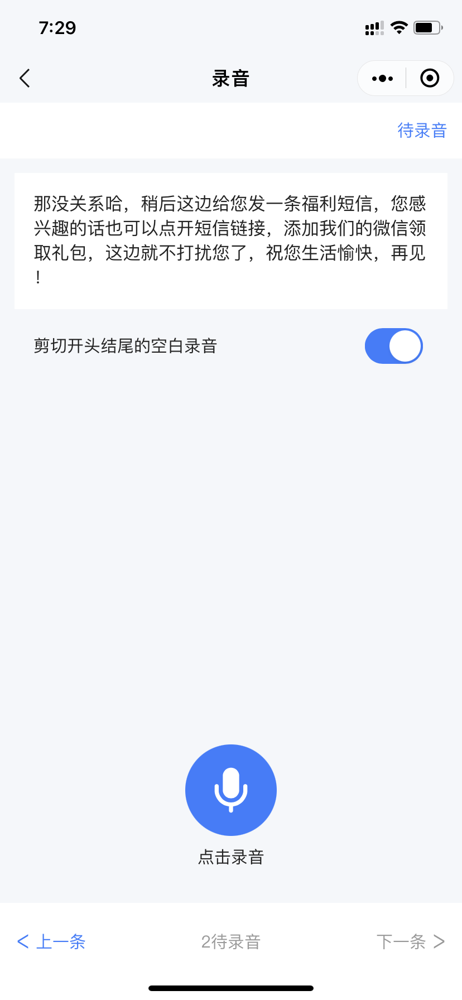
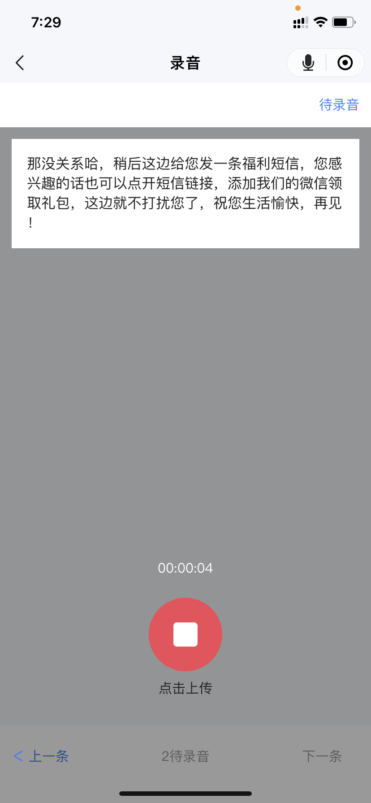
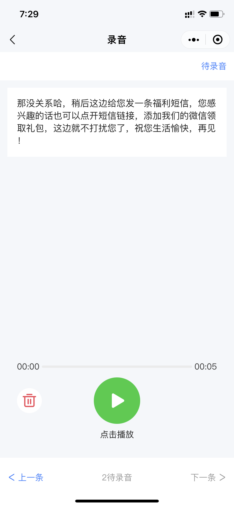

# 录音播放小程序
比较完整的小程序项目，提供了小程序录音、播放、上传等功能实现的参考。

主要使用以下 api
1. 全局唯一的录音管理器：[RecorderManager](https://developers.weixin.qq.com/miniprogram/dev/api/media/recorder/RecorderManager.html)
1. [wx.createInnerAudioContext](https://developers.weixin.qq.com/miniprogram/dev/api/media/audio/wx.createInnerAudioContext.html)： 创建内部 audio 上下文 [InnerAudioContext](https://developers.weixin.qq.com/miniprogram/dev/api/media/audio/InnerAudioContext.html) 对象

## 使用步骤
1. `npm i` // 如未有依赖，可忽略
1. 工具 -> 构建 npm 

## 约束
1. TS 声明文件放置 typings/ 中，不需要 import、export
1. git 过滤 ts 编译后的 js 文件，避免使用，非要使用统一放置 miniprogram/other/ 目录下
1. 不需要生成 .wxss 文件，改成 .less 文件，已开启编译

## 注意事项

```javascript
/**
 * 小程序陈年老 bug：
 * 提交审核 envVersion === 'develop'，
 * 根据这个字段区分接口域名，
 * 导致审核时无法访问内网的域名
 * 审核被驳回
 * 只能每次提交审核的时候手动改下代码
 * 测试的时候在改回来。。。
*/

// env.ts
const { miniProgram: { envVersion } } = wx.getAccountInfoSync();
```

## 常见问题
1. 如果发现编译失效，可手动尝试 `npm run tsc`，已开启自动编译 ts、less
1. 如无法预览、调试，关闭当前项目，点击导入右侧管理，删除当前项目，重新加载

PS. 最新开发工具，已支持自动生成 ts、less，忽略 js、wxss

## 部分展示
<div>
    
    
    
    
    
    
</div>
